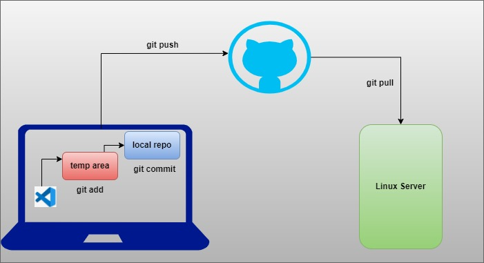

Loading our webiste steps doing manullay:

Shell Script
------------------
3 servers....

configuring the server?
------------------------
installed application runtime --> nodejs
downloaded code
created a directory
created a user for our application
unzip the code
installed node js dependencies
created systemctl service
configured mysql details
start the server

MySQL
----------
install mysql server
configure password
start the server

frontend
-----------
install nginx
start nginx
downloaded the code
unzipped
configured backend details
start the server

To my understanding:
---------------------

run commands one by one --> manual 
keep all commands in a file and run that file --> shell script

programming/developing scripting
---------------------------
Coding
	1. Programming/Developing --> reactjs, nodejs, java, .net, python, etc.
	2. Scripting
		automating manual tasks other than development
			server configuration
			installations
			deployment process

Perfect coding:
-------------------	
execution time should be less
memory consumption should be less
        To manage website what are needed for developing and coding
            	data structures
                alogorithms
                design patterns
                connect to DB
                fetch the data asap..
                transaction management


Scripting Concepts || Coding concepts
-----------------
    variables
    data types --> less priority in scripting
    functions
    loops
    conditions

what is shell?
----------------

shell is the CLI that interprets the linux commands and executes them

terminal == shell terminal

shell script --> keeping all the commands you need in a file with variables, conditions, loops, functions, etc is called shell script

who executes shell script?
shell interprets and executes shell script.

# Shell Script

**steps:**
* Create repo in Github
* Clone repo in local laptop
* Start developing
* Add the files to temp area
```
git add <file-name>
```
* Commit the changes
```
git commit -m "enter-your-commit-message"
```
* Push the changes to GitHub/Central repo
```
git push -u origin main
```

**naming convention: use small case with Hyphons(-). No spaces**

```
git add . ; git commit -m "some-message"; git push -u origin main
```

# git

Git is a popular source code management tool. It has below features.

* Version control
* Track the changes
* Review the changes
* Security and Backup
* Branching
* Collaboration



Shell Script
---------------
1st line -->#!/bin/bash

shebang is the location interpreter, commands written inside shell script is interpreted and executed by this shebang

zshell
kshell
cshell
fish

bash shell == shell

how to execute shell script
---------------------
sh <script>
bash <script>
./<script-name> --> this should have execute permission
X --> running the command/script